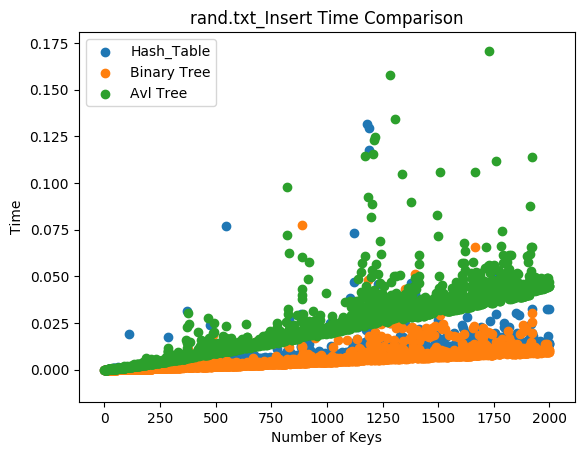
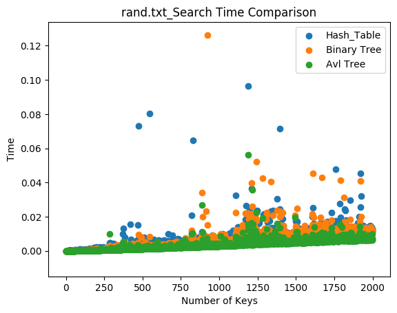
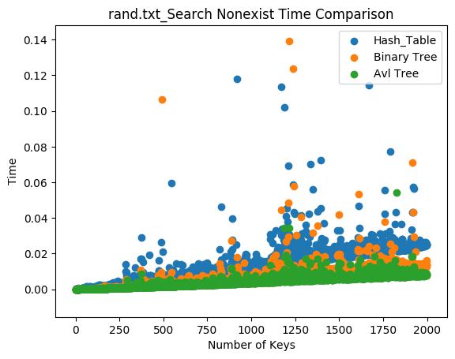
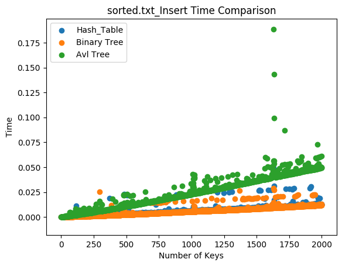
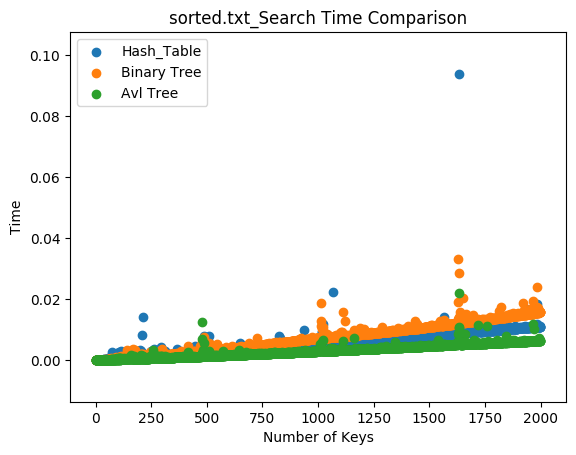
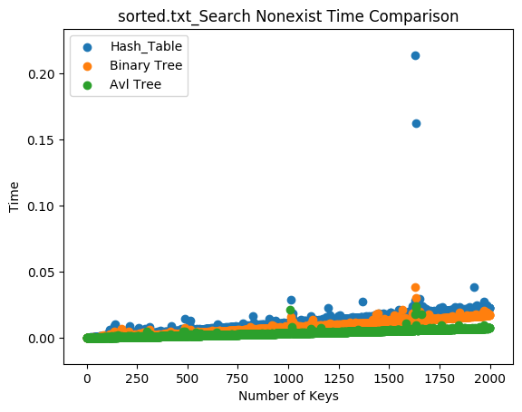

# Trees
Understanding the performance difference between hash tables and trees(binary tree and avl tree)
## Continuous Integration Status
[](https://travis-ci.com/cu-swe4s-fall-2019/trees-chzh1418)
## Required packages
* os
* sys
* argparse
* time
* importlib
* unittest
* pycodestyle

## Usage
The main program can benchmark the required time for insert and search different type of data structure.
To run the program use the following scripts:
```
python insert_key_value_paires.py --data_structure 'hash' --dataset rand.txt --key_value 10000
python insert_key_value_paires.py --data_structure 'binary_tree' --dataset rand.txt --key_value 10000
python insert_key_value_paires.py --data_structure 'avl_tree' --dataset rand.txt --key_value 10000
python insert_key_value_paires.py --data_structure 'hash' --dataset sorted.txt --key_value 10000
python insert_key_value_paires.py --data_structure 'binary_tree' --dataset sorted.txt --key_value 10000
python insert_key_value_paires.py --data_structure 'avl_tree' --dataset sorted.txt --key_value 10000
```
To run plot_figures.py
```
python plot_figures.py --dataset rand.txt --key_value 2000
python plot_figures.py --dataset sorted.txt --key_value 2000
```
## Functional test
```
bash test_insert_key_value_paires.sh 
```
## Unit test
```
python test_binary_tree.py
```
## Results
For radom keys





For sorted keys





## Conclusion
For random keys:
    The AVL tree structure takes the longest to insert key value paires. As the number of keys increase, the insertion gets slower and slower compare to other data structure.
    To search for existing keys, all there structures perform comparably.
    To search for non-existing keys, hash table structure takes longer to find. As the number of keys increase, the difference grows bigger compare to the other two.
For sorted keys:
    Similar to randome key, the AVL tree structure also takes longer to insert.
    To search for existing keys, it looks like binary tree performs worst.
    To search for non-existing keys, again hash table takes longer.

To compare sorted and random keys:
    Within the range of 0 to 2000 keys, it doesn't seem like there is a significant difference among sorted and random keys in terms of insertion and search.

